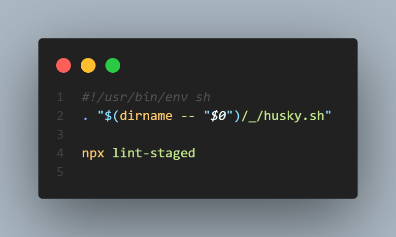

# 네이버 뉴스 검색

---

## 👀 Introduce

- 해당 프로젝트는 **React-table**, **React-query** 그리고 **shadcn/ui**를 학습하기 위한 목적으로 제작 했습니다.
- 추가적으로 husky, react portals 그리고 yup에 대해서 간단한 사용법을 배워보려고 합니다.
- 1차 목표는 우선 back-end 없이 네이버 뉴스 api를 이용해서 제작하고 기회가 되면 firebase를 이용하여 백앤드를 구현할 예정입니다

## 👨‍👦 참여 멤버

<table>
    <tr align="center">
        <td><B>정재훈<B></td>
        <td><B>이선희<B></td>
    </tr>
    <tr align="center">
        <td>
            
            <br>
            <a href="https://github.com/pleasemrlostman"><I>정재훈</I></a>
        </td>
        <td>
            
            <br>
            <a href="https://github.com/suniiizz"><I>이선희</I></a>
        </td>
    </tr>
</table>

## 🖥️ 기술 스택 및 사용 라이브러리

- shadcn/ui
- react-query
- react-table
- vite / eslint / husky

## 📚 기록할 사항들

- **사용 스택 정리**
  - [react-query](https://github.com/pleasemrlostman/news-search-table/blob/main/src/hooks/README.md)
- **Component 제작과정**
  - [Select](https://github.com/pleasemrlostman/news-search-table/tree/main/src/components/select)
- **husyky 세팅**
  - [husky 참고링크](https://xiubindev.tistory.com/136)
  - `.husky/_/pre-commit`
    
    - **`#!/usr/bin/env sh`**
      - 이 첫 번째 줄은 이 스크립트가 어떤 셸을 사용할 것인지를 지정합니다. 이 스크립트는 "sh" 셸을 사용합니다.
    - **`. "$(dirname -- "$0")/_/husky.sh"`**
      - 이 줄은 스크립트 파일이 위치한 디렉토리 내의 "\_/husky.sh" 파일을 실행합니다. 이 파일은 Husky 프로젝트의 실행 스크립트인데, Git 훅(hook)을 관리하고 실행하는 데 사용됩니다. 이 스크립트는 Husky를 초기화하고 Git 훅 설정을 로드합니다.
    - **`npx lint-staged`**
      - 이 명령어는 "npx"를 사용하여 "lint-staged" 패키지를 실행합니다. "lint-staged"는 Git 스테이징 영역에 있는 변경된 파일에 대해 지정된 명령어를 실행하는 도구입니다. 보통, 코드 포맷팅, ESLint 검사 및 다른 정적 분석 도구와 같이 전반적인 코드 품질을 검사하거나 개선하는 데 사용됩니다. "npx"는 "lint-staged"를 프로젝트 로컬 노드 모듈로 설치된 패키지를 실행하기 위해 사용됩니다.
  - `package.json`
    
    - **`"*.{js,jsx,ts,tsx}"`**
      - **`"*.{js,jsx,ts,tsx}"`**는 정규 표현식 패턴으로, JavaScript와 TypeScript 파일을 대상으로 합니다. 즉, 이 규칙은 프로젝트에서 해당 확장자를 가진 모든 JavaScript 및 TypeScript 파일을 대상으로 합니다.
    - **`"prettier --cache --write"`**
      - 이 부분은 Prettier를 실행하는 명령어입니다. "prettier"는 코드 포맷팅 도구로, 코드를 일관된 스타일로 자동으로 정리합니다. **`--cache`** 옵션은 이미 포맷팅된 파일을 건너뛰고, **`--write`** 옵션은 파일을 직접 수정하여 포맷팅을 적용합니다. 따라서, 스테이징 영역에 있는 파일이 Prettier로 자동 포맷팅됩니다.
    - **`"eslint --cache --fix --max-warnings=0"`**
      - 이 부분은 ESLint를 실행하는 명령어입니다. ESLint는 JavaScript 및 TypeScript 코드의 품질을 검사하는 정적 분석 도구입니다. **`--cache`** 옵션은 이미 검사된 파일을 건너뛰고, **`--fix`** 옵션은 가능한 오류를 자동으로 수정하려고 시도합니다. **`--max-warnings=0`** 옵션은 경고가 발생하면 커밋을 중지시키는 옵션으로, 커밋 시에 ESLint가 0개의 경고를 보장합니다.
- **eslint 세팅**

  - **`eslintrc.cjs`**
    

- **route error**
  ### route error
    <aside>
    📝 ****react-router-dom 에서 제공하는 errorElement로 에러를 핸들링 해보자****
    
    </aside>
    
    `react-router-dom v6` 업데이트 이후 `v5`와 많은 부분이 변경됐다. 특히 `<RouteProvider />` 라는 컴포넌트를 이용해서 `createBrowserRouter` 함수의 리턴값을  전달해서 `route` 구조를 잡아 나갔다.
    
    ```tsx
    // @/App.tsx
    import { RouterProvider, createBrowserRouter } from "react-router-dom";
    import routes from "@/routes";
    
    const App = () => {
      const router = createBrowserRouter([routes]);
      return <RouterProvider router={router} />;
    };
    
    export default App;
    
    ```
    
    ```tsx
    // @/routes/index.tsx
    
    import { RouteObject } from "react-router-dom";
    import Main from "./main";
    import Layout from "@/components/layout";
    import RouteError from "@/components/error-component/route-error";
    const routes: RouteObject = {
      path: "/",
      element: <Layout />,
      children: [{ index: true, element: <Main /> }],
      errorElement: <RouteError />,
    };
    
    export default routes;
    ```
    
    특이점은 `errorElement`를 이용해서 `404 에러`를 컨트롤 할 수 있다.
    
    ```tsx
    // @src/components/error-component/route-error.tsx
    import { useRouteError, isRouteErrorResponse, Link } from "react-router-dom";
    import { CircleOff as CircleOffIcon } from "lucide-react";
    import { Button } from "@/components/ui/button";
    const RouteError = () => {
      const error = useRouteError();
      if (isRouteErrorResponse(error) && error.status === 404) {
        return (
          <div className="w-screen h-screen flex items-center justify-center flex-col gap-1">
            <CircleOffIcon className="w-1/6 h-1/6" />
            <p className="italic text-[6rem] font-bold">404</p>
            <p className="text-[2rem]">Page Not Found</p>
            <p className="text-xl">
              You can search for the page you want here or return to the homepage
            </p>
            <Button className="mt-5">
              <Link to="/">Back</Link>
            </Button>
          </div>
        );
      }
    };
    
    export default RouteError;
    ```
    
    라우팅하지 않은 URL로 접속하면 `useRouteError`에서 `error` 객체를 리턴 한다. 아직 다른 에러는 확인해보지 못했지만 단순히 `404` 에러를 제어하기에는 적합해 보인다.
    
    `404` 에러는 해당 기능을 통해서 쉽게 해결 할 수 있지만 그 외 다른 에러는 React에서 제공해주는 **`ErrorBoundary`** 기능을 학습할 필요가 있어보인다.
    

    - ErrorBoundary 참조자료
        - [링크](https://jikor1st.tistory.com/23?category=1271628)
        - [공식 문서](https://ko.legacy.reactjs.org/docs/error-boundaries.html)
